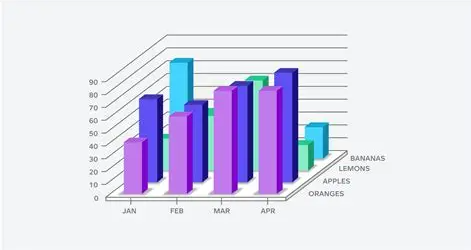
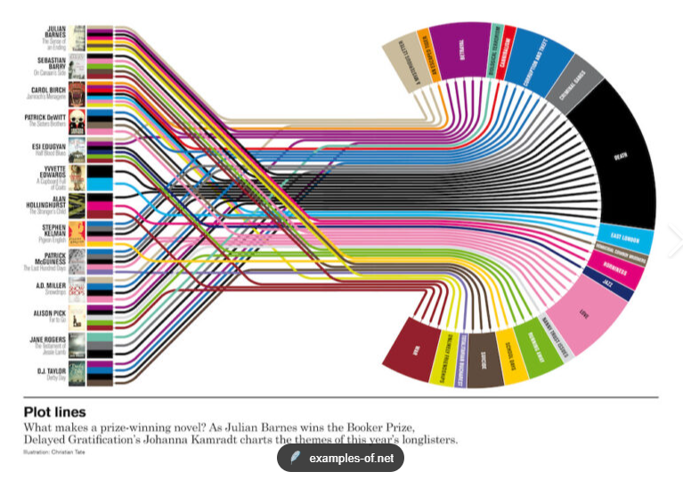
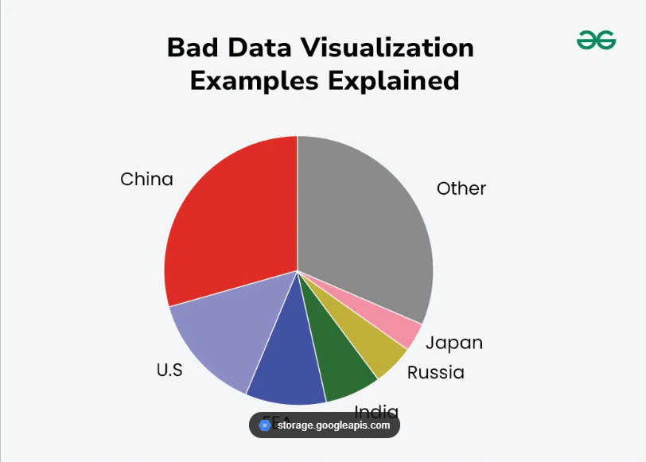

## Graphique en barre 3D fruit et mois.

 

**Pourquoi c'est trompeur**
- L'effet 3D fausse la perception des hauteurs : selon l'angle et la profondeur, deux barres de même valeur ne semblent pas avoir la même hauteur.
- Les barres à l'arrière sont masquées par celles de devant, certaines valeurs deviennent illisibles.
- Les lignes de grille ne pointent plus vers le sommet exact des barres à cause de la perspective : impossible de lire une valeur précise.
  
**Comment corriger**
- Repasser en 2D 
- Une dataviz par pays 
- Ajouter les valeurs directement au-dessus des barres.

## Diagramme en éventail 

 

**Pourquoi c'est trompeur**
- trop de lignes qui se croisent, l'œil ne peut plus suivre un chemin facilement.
- Le code couleur devient illisible.
- 
**Comment corriger**
- Rendre le graphique interactif : au survol d'un livre ou d'un thème, ne surligner que les liens concernés.
- Réduire le nombre de couleurs/thèmes affichés simultanément, regrouper les thèmes proches.

## Camembert

 

**Pourquoi c'est trompeur**
- Trop de catégories: on compare mal les angles/aires, surtout pour les petites parts (Japon, Russie, Inde) quasi illisibles.
- Les couleurs ne suivent aucun ordre logique de valeur, ce qui complique la comparaison.
- La catégorie « Other » agrège des données non détaillées, masquant potentiellement des infos importantes.
- Aucun pourcentage affiché sur les tranches : impossible de connaître les chiffres exacts sans deviner.

**Comment corriger**
- Ajouter les valeurs en pourcentages 
- limiter à 4-5 tranches max, expliciter le contenu d'« Other ».
- Utiliser un dégradé de couleur cohérent avec l'ordre des valeurs.
